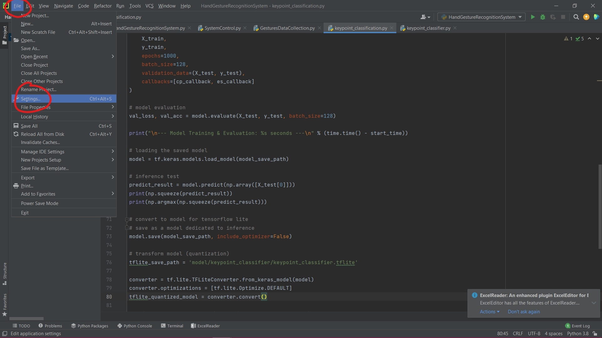
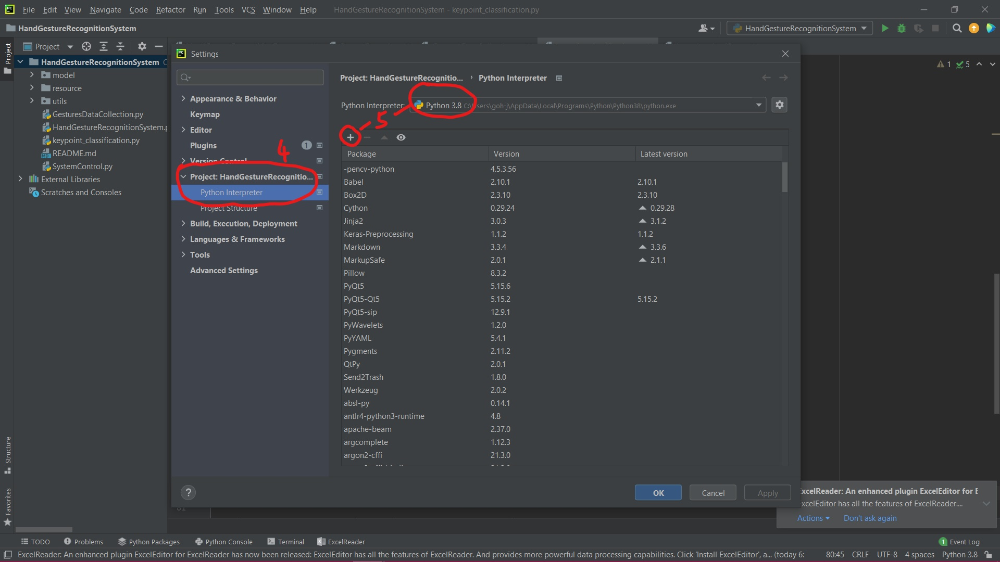
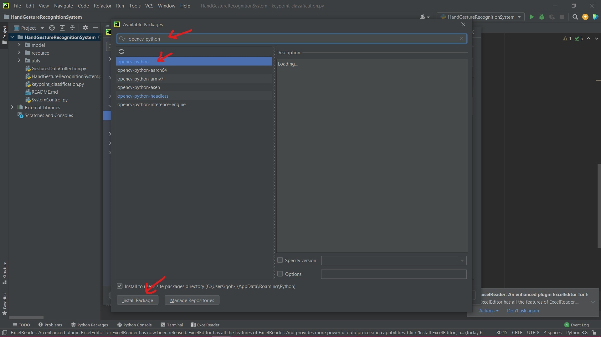

# Hand Gesture Recognition System for Human Computer Interaction

## Requirements 

* PyCharm (version 2021.2.2)
* python (version 3.8)
* opencv-python (version 4.5.3.56)
* mediapipe (version 0.8.7.3)
* tensorflow (version 2.8.0)
* autopy (version 4.0.0)
* pynput (version 1.7.6)
* scikit-learn (version 1.0.2) (only if you want to train data)

*** The version provided is for reference only

## Set Up 

1. Unzip the file and open in PyCharm platform
2. Go to File tab at the top left and select Settings

4. In the Settings, go to Project and select Python Interpreter
5. Select your Python Interpreter and click the "add" button

6. Install the following libraries:
    1. opencv-python
    2. mediapipe
    3. tensorflow
    4. autopy
    5. pynput
    6. scikit-learn (only if you want to train data)
   
 7. After installing all the libraries, close the current window and click "OK"
 
 *** Note that you can skip this section if you have installed these libraries before

## How/What To Run 

### HandGestureRecognitionSystem.py (Main Program)

This is the main program of the project which the system will recognize the trained gestures and perform computer control.
Run this program if you want to start the hand gesture recognition system.
It will display a GUI first, then you have to click a RED button on the home page to start the recognition system. 
The button will also turn into GREEN after the system is turned on.
To close the recognition system, you have to click the GREEN button on the GUI.
The GUI provided a list of available gestures and their associated functions inside the second tab.

### GesturesDataCollection.py

This program is used to collect the hand gesture data.
Run this program ONLY if you want to collect new gesture data.
To collect the data, pose your gesture in front the camera, and click a number key which will be used as the class ID of the gesture.
NOTE that class ID from 0 to 47 are already used in the project.
To save a class ID of 48 (for example), you need to click the number key "8" when saving the gesture in the program. 
Then, exit the program and open the CSV file (keypoint.csv) to modify the number "8" (which will be in the last row of the first column) to "48" manually.
NOTE that be careful not to modify the wrong number.
You may also need to modify the label of the gestures in the keypoint_classifier_label.csv file (which is just giving a name for the gestures)

### keypoint_classification.py

This program is used to train the collected gesture data.
Run this program ONLY if you want to perform the training for the data.
The variable NUM_CLASSES inside the code indicates the total number of the collected gestures.
In this case, there are 48 gestures collected for the project, so NUM_CLASSES = 48.
Change the number if you added new gestures.

